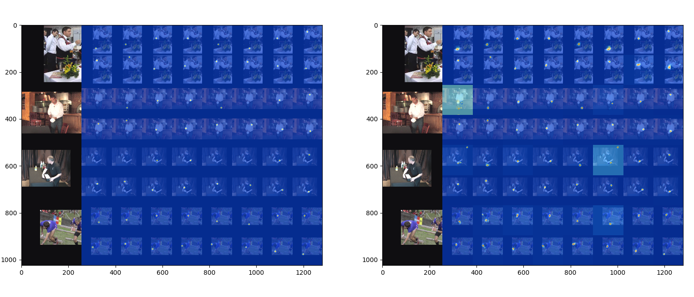

# CS236605 Final Project

You can find our project report at report.pdf


Under pose/models/hourglass.py you can find our improvements.

To run an experiment run: 
```
python ./example/main.py --dataset mpii --arch hg --stack 1 --block 1 --features 256 --checkpoint checkpoint/s1/ 
```
Or one of our scripts for the src/ dir, for example:
```
sbatch -c 2 --gres=gpu:1 -p 236605 -o s2_exp.out -J s2_exp run_dec_2.sh
```

notice that the MPII dataset must be located in /data/mpii/

checkpoint/ - saves the model after each epoch when increasing accuracy
data/ - should contain the datasets
pose/ - the model's code




## Installation
PyTorch (>= 0.4.1): Please follow the [installation instruction of PyTorch](http://pytorch.org/). Note that the code is developed with Python2 and has not been tested with Python3 yet.

Download annotation file:
    (MPII) Download [mpii_annotations.json](https://drive.google.com/open?id=1mQrH_yVHeB93rzCfyq5kC9ZYTwZeMsMm) and save it to `data/mpii`
